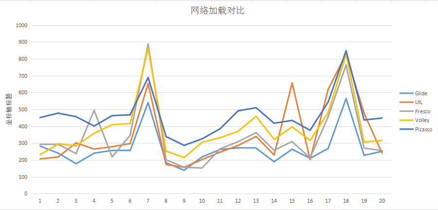
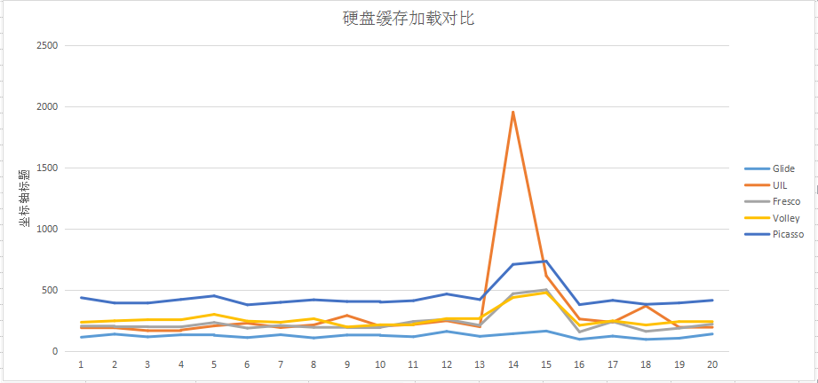
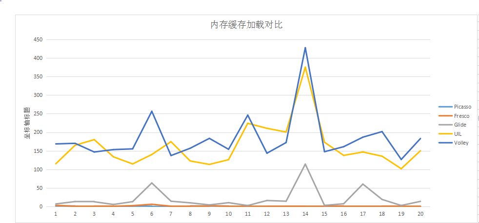

# ImageLoaders
这是一个对比当前Android上主流图片加载库的项目，参与对比的项目有UIL,Picasso,Volley-ImageLoader,Fresco,Glide。

##图片加载库列表及简介
|Repo|Author|version|Description|
|:--:|:--:|:------:|:---:|
|[Android-Universal-Image-Loader][1]|[nostra13][2]|1.9.5|Powerful and flexible library for loading, caching and displaying images on Android|
|[picasso][3]|[Square.Inc][4]|2.5.2|A powerful image downloading and caching library for Android|
|[Volley-ImageLoader][5]|[Google.Inc][6]|1.0.19|Android official network library more than image loader|
|[fresco][7]|[Facebook.Inc][8]|0.8.1|An Android library for managing images and the memory they use|
|[glide][9]|[Sam sjudd][10]|3.6.1|An image loading and caching library for Android focused on smooth scrolling|

Universal-Image-Loader:Android上开源最早的图片加载库，被很多APP使用，支持丰富的自定义配置,只是现在已经不再开发维护了。

Picasso：Square出品，是Android上最轻量级的图片加载库，使用简单。

Volley-ImageLoader:Volley是Android官方出的网络库，只是包含了图片加载的功能。因为是网络库，并不是图片加载库，所以不支持本地图片加载，而且使用不友好。

Fresco：Facebook出的，支持Native缓存，支持多种图片格式，功能最为强大，但因为还没有出稳定版，而且需要使用自定义view来加载图片，而不是系统原生的ImageView,不建议迁移使用。

Glide：Google员工的开源项目，在泰国举行的谷歌开发者论坛上被Google推荐，并广泛应用在Google自家的APP里面。支持与Activity和Fragment生命周期联动，内存友好。但代码量庞大，难以理解。

##加载速度测试
分别在从网络加载，从磁盘缓存加载，从内存缓存中加载测试20次。因不同的图片加载库都有很多的自定义配置，这里采用Lazy Configuration，即默认的最简单配置。

第一次从网络加载时，普遍都比较慢，时间大都>=200ms(WIFI情况下，View长宽均为100dp)，其中UIL,Fresco,Glide表现良好，Picasso和Volley相对性能较低。

当内存不足或者应用进程被杀掉时，从磁盘缓存读取，普遍比网络读取速度快，其中Glide优势最为明显，可能因为Glide缓存时不仅缓存原图还缓存效果图把。UIL和Fresco几乎差不多，Volley次之，Picasso最差。

大多数图片加载库都有内存缓存机制，可以看到，从内存中加载都是最快的，Picasso和Fresco都可以达到0-2ms之间，几乎不相上下，Glide也可以达到20ms之内，而UIL和Volley性能就差的很多，基本上都在100ms朝后。
详细数据请看[这里](https://github.com/Alluretears/ImageLoaders/blob/master/data/imageloaders.xlsx)。

[1]: https://github.com/nostra13/Android-Universal-Image-Loader
[2]: https://github.com/nostra13
[3]: https://github.com/square/picasso
[4]: https://github.com/square
[5]: https://android.googlesource.com/platform/frameworks/volley
[6]: https://github.com/google
[7]: https://github.com/facebook/fresco
[8]: https://github.com/facebook
[9]: https://github.com/bumptech/glide
[10]: https://github.com/sjudd
